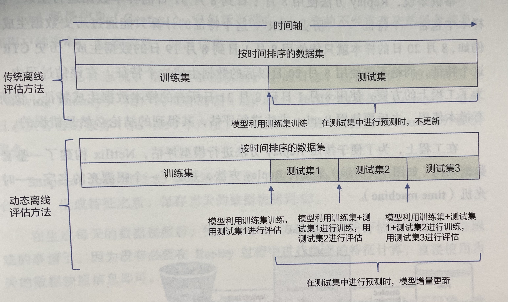

ML总复习

[TOC]

# ML基础

- 回归、分类、聚类、模型融合提升、其他重要算法

## 1. 经典问题

### L1 和 L2 范数

L1 和 L2 范数在机器学习上最主要的应用大概分下面两类

- 作为**损失函数**使用
  - L1-norm:  least absolute deviation (LAD，最小绝对偏差)
  - L2-norm: least squares error (最小二乘误差 , LSE)
- 作为**正则项**使用
  - L1正则化可以产生稀疏权值矩阵，即产生一个稀疏模型，可以用于特征选择
  - L2正则化可以防止模型过拟合（overfitting）；一定程度上，L1也可以防止过拟合

> - L1与L2的区别：
>
> L1是模型各个参数的绝对值之和，L2是各个参数平方和的开方。L1更趋向于产生少量的特征，其他特征为0，最优参数值很大概率出现在坐标轴上，从而产生稀疏的权重矩阵。
>
> [ref](https://blog.csdn.net/jinping_shi/article/details/52433975?utm_medium=distribute.pc_relevant.none-task-blog-2%7Edefault%7EBlogCommendFromMachineLearnPai2%7Edefault-1.control&depth_1-utm_source=distribute.pc_relevant.none-task-blog-2%7Edefault%7EBlogCommendFromMachineLearnPai2%7Edefault-1.control)

> - 解决L1求导困难：
>
> 坐标轴下降法：更新一个特征参数，估计其余特征参数，眼坐标轴方向更新。

### 特征选择方法

- 方差、Pearson相关系数（相关+1/-1）、互信息（共现）等
- L1正则化

### 过拟合原因及解决办法

- 数据增强
- 特征筛选：减少特征
- 正则化：l1、l2
- 集成学习：bagging

不同模型：

- 决策树剪枝
- SVM松弛变量

深度学习：

- 早停

- dropout

### 损失函数种类/区别

- 平方损失函数
  $$
  \sum_N (Y-f(x))^2
  $$
  应用：回归问题

- 交叉熵损失函数
  $$
  L = - \frac 1 N \sum_N [ylogf(x) + (1-y)log(1-f(x))]
  $$
  应用：分类任务

  特点：

  (1) log对数损失函数能非常好的表征概率分布，在很多场景尤其是多分类，如果需要知道结果属于每个类别的置信度，那它非常适合。

  (2) 健壮性不强，相比于hinge loss对噪声更敏感。

> - **交叉熵函数**与**最大似然函数**的联系和区别：
>
> 区别：**交叉熵函数**使用来描述模型预测值和真实值的差距大小，越大代表越不相近；**似然函数**的本质就是衡量在某个参数下，整体的估计和真实的情况一样的概率，越大代表越相近。
>
> 联系：**交叉熵函数**可以由最大似然函数在**伯努利分布**的条件下推导出来，或者说**最小化交叉熵函数**的本质就是**对数似然函数的最大化**。
>
> [ref](https://zhuanlan.zhihu.com/p/58883095)

>- 在用sigmoid作为激活函数的时候，为什么要用**交叉熵损失函数**，而不用**均方误差损失函数**：
>
>求导即可，均方误差求导时包含sigmoid导数项，在两端梯度更新慢。
>
>[ref](https://zhuanlan.zhihu.com/p/58883095)

- 合页(Hinge)损失函数

$$
L = max(0, 1-yf(x))
$$

应用：SVM

特点：

(1) hinge损失函数表示如果被分类正确，损失为0，否则损失就为 ![[公式]](https://www.zhihu.com/equation?tex=1-yf%28x%29) 

(2) 一般的 ![[公式]](https://www.zhihu.com/equation?tex=f%28x%29) 是预测值，在-1到1之间， ![[公式]](https://www.zhihu.com/equation?tex=y) 是目标值(-1或1)。其含义是， ![[公式]](https://www.zhihu.com/equation?tex=f%28x%29+) 的值在-1和+1之间就可以了，并不鼓励 ![[公式]](https://www.zhihu.com/equation?tex=%7Cf%28x%29%7C+%3E+1) ，即并不鼓励分类器过度自信，让某个正确分类的样本距离分割线超过1并不会有任何奖励，从而**使分类器可以更专注于整体的误差。**

(3) 健壮性相对较高，对异常点、噪声不敏感，但它没太好的概率解释。

### 机器学习性能评价

|                  | actual positive | actual negative |
| ---------------- | --------------- | --------------- |
| predict positive | TP              | FP              |
| predict negative | FN              | TN              |

$$
precision = \frac {TP}{TP+FP} \\
recall = \frac {TP}{TP+FN} \\
accuracy = \frac {TP+TN}{TP+FP+FN+TN} \\
true\ positive\ rate(TPR) = recall = \frac {TP}{TP+FN} \\
false\ positive\ rate(FPR) = \frac {FP}{FP+TN}
$$

- PR曲线

  横轴是Recall，纵轴是Precision

  - 优点：

    对于类别分布差异敏感，常常用于样本类别不平衡的情况，因为PR曲线变换敏感，并且更加关心正例样本。

  - 缺点：

    PR曲线对于类别不平衡，图像变换比较明显，除此之外，PR曲线过于粗糙，没办法精确的反应模型的性能。但我们可以从F1值直观的反应出来。

- ROC曲线、AUC

  横坐标是假阳率**FPR，**纵坐标是真阳率**TPR**/**Recall**

  - 优点：

  1. 可以兼顾正负样本的评估。因为ROC的横轴是FPR，纵轴是TPR，TPR聚焦于正样本、FPR聚焦于负样本。故ROC曲线是一个比较均衡的评估方法。
  2. ROC的两个指标都不依赖于具体的样本分布。
  3. ROC对于类别不平衡，反映到图上并不敏感。PR很敏感。

  - 缺点：

  1. ROC的优点也就是不随着类别分布而改变，或者说改变很小。这也是他的缺点，因为如果我们需要通过指标观测到类别分布变换带来的影响的话，ROC曲线便不适合。但是PR就很合适，因为PR也会随着类别分布的变换带来明显的变化。但是如果想要比较分类器的性能或者剔除掉类别分布的影响，ROC还是更合适的。
  2. ROC曲线在类别分布不平衡下，表现出过于乐观的评估结果。

  [ref](https://zhuanlan.zhihu.com/p/361214293)

  

- AUC

  ROC曲线下的面积，AUC值越大，说明曲线顶点越靠近左上角，那么真阳率就越大于假阳率，那么模型就越可能将正样本排在负样本前面。

  从统计特性的角度理解：AUC等于随机挑选一个正样本和负样本时，模型对正样本的预测分数大于负样本的预测分数的概率。

  计算公式：
  $$
  AUC = \frac {\sum_{a\in P}rank_a - \frac {|P|(|P|-1)}{2}}{|P|*|N|}
  $$
  P：表示正样本

  N：表示负样本

  |P|：表示正样本数量

  |N|：表示负样本数量

  $|rank_a|$： 表示根据模型的预测值升序排行，样本a的顺序编号。

  优点：

  1. AUC衡量的是一种排序能力，因此特别适合排序类业务；

  2. AUC对正负样本均衡并不敏感，在样本不均衡的情况下，也可以做出合理的评估。

  3. 其他指标比如precision，recall，F1，根据区分正负样本阈值的变化会有不同的结果，而AUC不需要手动设定阈值，是一种整体上的衡量方法。

  缺点：

  1. 忽略了预测的概率值和模型的拟合程度；

  2. AUC反应了太过笼统的信息。无法反应召回率、精确率等在实际业务中经常关心的指标；

  3. 它没有给出模型误差的空间分布信息，AUC只关注正负样本之间的排序，并不关心正样本内部，或者负样本内部的排序，这样我们也无法衡量样本对于好坏客户的好坏程度的刻画能力；

  [ref](https://zhuanlan.zhihu.com/p/360765777)

### 优化算法

- 梯度下降

  批梯度下降、小批量梯度下降、随机梯度下降（SGD）

  更新速度依次增加、准确度（稳定性）依次减小

- Momentum

  动量法是一种帮助SGD在相关方向上加速并抑制摇摆的一种方法。动量法将历史步长的更新向量的一个分量γ增加到当前的更新向量中。
  $$
  v_t = \gamma v_{t-1} + \eta \nabla_\theta J(\theta) \\
  \theta = \theta - v_t
  $$

- Adagrad

  让学习率适应参数，对于出现次数较少的特征（参数），我们对其采用更大的学习率，对于出现次数较多的特征，我们对其采用较小的学习率。因此，Adagrad非常适合处理稀疏数据。

  前面，我们每次更新所有的参数θ时，每一个参数θi都使用的是相同的学习率η。由于Adagrad在t时刻对每一个参数θi使用了不同的学习率。
  $$
  g_{t,i} = \nabla_\theta J(\theta_i) \\
  \theta_{t+1,i} = \theta_{t,i} - \eta g_{t,i} 
  = \theta_{t,i} - \frac {\eta}{\sqrt{G_{t,ii}+\epsilon}} \cdot g_{t,i}
  $$
  其中，$G_t \in ℝ^{d×d}$是一个对角矩阵，对角线上的元素$i,i$是直到$t$时刻为止，所有关于$θ_i$的梯度的平方和.
  $$
  \theta_{t+1} = \theta_{t} - \frac {\eta}{\sqrt{G_{t}+\epsilon}} \odot g_t
  $$
  Adagrad算法的一个主要优点是无需手动调整学习率。在大多数的应用场景中，通常采用常数0.01。

  Adagrad的一个主要缺点是它在分母中累加梯度的平方：由于没增加一个正项，在整个训练过程中，累加的和会持续增长。这会导致学习率变小以至于最终变得无限小，在学习率无限小时，Adagrad算法将无法取得额外的信息。

- Adam

  自适应矩估计（Adaptive Moment Estimation，Adam）：Adam对每一个参数都计算自适应的学习率，并存储一个指数衰减的历史平方梯度的平均$v_t$，Adam同时还保存一个历史梯度的指数衰减均值$m_t$，类似于动量：
  $$
  m_t = \beta_1 m_{t−1} + (1−\beta_1) g_t \\
  v_t = \beta_2 v_{t−1} + (1−\beta_2) g_t^2
  $$
  $m_t$和$v_t$分别是对梯度的一阶矩（均值）和二阶矩（非确定的方差）的估计。

  通过计算偏差校正的一阶矩和二阶矩估计来抵消偏差：
  $$
  \hat m_t = \frac {m_t}{1−\beta1_t} \\
  \hat v_t = \frac {v_t}{1−\beta2_t}
  $$
  Adam更新规则：
  $$
  \theta_{t+1} = \theta_{t} - \frac {\eta}{\sqrt{\hat v_t} + \epsilon} \hat m_t
  $$
  作者建议$\beta_1$取默认值为0.9，$\beta_2$为0.999，$\epsilon$为10−8。他们从经验上表明Adam在实际中表现很好，同时，与其他的自适应学习算法相比，其更有优势。

[ref](https://blog.csdn.net/google19890102/article/details/69942970)

### 小样本/不均衡样本训练

- 扩大或过采样（小样本）数据集，欠采样（大样本）数据集，SMOTE等方法人工构造小样本数据
- 用决策树等对样本分布不敏感的模型
- 改变样本权值
- 使用F1、AUC等评价指标

## 2. 基本模型

### 逻辑回归

本质是在线性回归结果的映射中加入了一层sigmoid函数。

> - 逻辑回归基本假设
>
> 样本符合伯努利分布

> - 损失函数推导
>
> 对数似然函数求最大值

> - 逻辑回归怎么实现多分类
>
> 方法一：修改损失函数，变为softmax函数
>
> 方法二：每个类别分别建立一个二分类器（每个类别不互斥）

### SVM

SVM是二类分类模型，基本模型是在特征空间上的间隔最大的线性分类器。

通过KKT条件，SVM只和分类界限上的支持向量有关，与其他数据无关

推导过程：原始问题 -> 凸二次规划问题 -> 对偶问题（拉格朗日函数的极大极小问题）-> 求解对偶问题的解 -> 得到原始问题的解

核技巧可以学习非线性SVM，隐含从低位空间到高维空间的映射，等价于在高维特征空间学习线性SVM。

高效实现带核函数SVM学习：SMO算法

> - SVM核函数的选择
>
> 线性核：特征提取的较好/特征较多，所包含的信息量足够大，很多问题是线性可分的
>
> 高斯核（优先选择）：特征数较少，样本量适中，对时间不敏感，问题是线性不可分的

[ref](https://zhuanlan.zhihu.com/p/38163970)

### 朴素贝叶斯

生成式模型，学习输入和输出的联合概率分布。**假设特征条件独立**。

贝叶斯公式：
$$
P(B|A) = \frac {P(B \cap A)}{P(A)} = \frac {P(A|B)\cdot P(B)}{P(A)}
$$
$P(B)$：先验概率（Prior probability）指事情还没有发生，求这件事情发生的可能性的大小，是先验概率。它往往作为"由因求果"问题中的"因"出现。

$P(A|B)$：似然函数 又叫条件概率，一般是通过历史数据统计得到。

$P(B|A)$：后验概率 指事情已经发生，求这件事情发生的原因是由某个因素引起的可能性的大小。后验概率的计算要以先验概率为基础。

- 优点：
  - 算法逻辑简单,易于实现
  - 分类过程中时空开销小

- 缺点：
  - 朴素贝叶斯模型假设属性之间相互独立，这个假设在实际应用中往往是不成立的，在属性个数比较多或者属性之间相关性较大时，分类效果不好。

[ref](https://zhuanlan.zhihu.com/p/26262151)

### 决策树

ID3

交叉熵公式

CART

Random forest -> AdaBoost -> GBDT -> XGBoost -> Lightgbm

移步csdn：[ref](https://blog.csdn.net/weixin_42939835/article/details/107172872)

### EM

用于含有隐变量的概率模型参数的极大似然估计。

两步：E步，求期望；M步，求极大

一般条件下EM算法是收敛的，但不能保证是全局最优。

### HMM

一个有隐节点和可见节点的马尔可夫过程。

三要素：初始状态概率向量、状态转移概率矩阵、观测概率矩阵。

三个基本问题：

- 概率计算问题 (likelihood)

  已知模型参数，求观测序列矩阵

  - 前向算法
  - 后向算法

- 学习问题 (training)

  已知观测序列，没有对应的状态序列，求模型参数

  - EM算法

- 预测问题 (decoding)

  已知模型参数、观测序列，求最可能的状态序列

  - 维特比 (Viterbi) 算法：动态规划

# 深度学习

## 1. 常见激活函数及用法

如果没有激活函数，那么模型都是线性组合，不具备拟合复杂分布

- **sigmoid**

  缺点：

  - 由于函数两边导数为0，很容易造成梯度消失
  - sigmoid 的 output 不是0均值，产生的一个结果就是：如 $x>0, f = w^Tx+b$ ，那么对**w求局部梯度则都为正，这样在反向传播的过程中w要么都往正方向更新，要么都往负方向更新，导致有一种捆绑的效果，使得收敛缓慢**。 
  - 幂运算计算量大

- **tanh**：
  $$
  P(v)=\frac{exp(x)-exp(-x)}{exp(x)+exp(-x)}
  $$
  解决了sigmoid函数不是0均值的问题，收敛速度快，梯度消失和幂运算问题依旧存在。

  - **relu**

    - 解决梯度消失，计算导数速度快。
    - relu在负半区导数为0，即梯度为零，此神经元不参与训练，具有稀疏性。
    - 但不是0均值输出

  - **gelu**

## 2. 梯度传递

- BP梯度反向传递推导:  [https://zhuanlan.zhihu.com/p/23270674](https://zhuanlan.zhihu.com/p/23270674)

- 梯度消失爆炸解决

  1. 使用ReLU等激活函数

  2. 使用batch normalization（批规范化）

## 3. CNN+Pooling

* 卷积作用
  * **稀疏交互( Sparse Interaction)：**全连接神经网络任意一对输入与输出神经元之间都产生交互，形成**稠密**的连接结构。而在卷积神经网络中，卷积核尺度**远小于**输入的维度，这样每个输出神经元仅与前一层**特定局部区域**内的神经元存在连接权重(即产生交互)，这种特性称为稀疏交互。稀疏交互使得优化过程的**时间复杂度减小几个数量级**，**过拟合**情况也得到较好的改善。稀疏交互的物理意义是，通常图像、文本、语音等现实世界中的数据都具有局部的特征结构，我们可以先学习局部的特征，再将局部的特征组合起来形成更复杂和抽象的特征。
  * **参数共享(Parameter Sharing)**：参数共享是指在同一个模型的不同模块中使用相同的参数。全连接神经网络在计算每层的输出时，权值参数矩阵中的每个元素只作用于某个输入元素一次；而卷积神经网络的卷积核中的每一个元素将作用于每一次局部输入的特定位置上，根据参数共享的思想，我们只需要学习一组参数集合，而不需要针对每个位置的每个参数都进行优化，大大**降低了模型的存储需求**。参数共享的物理意义是使得卷积层具有**平移不变性**。假如图像中有一只猫，那么无论它出现在图像中任何位置，都应该将它识别为猫。也就是神经网络的输出对于平移变换来说应当是等变的。
* Pooling作用
  * **等变表示**：当输入作出少量平移时，池化能帮助输入的表示近似**不变**(invariant)。对于平移的不变性是指当我们对输入进行少量平移时，经过池化函数后的大多数输出并不会发生改变。这意味着池化对特征位置不敏感

## 4. 循环神经网络

- RNN：

  

$$
O_t = g(V*S_t)\\S_t =f(U*X_t+W*S_{t-1})
$$

​	对于普通RNN来说，每一层输出取决于上一层输出和这一层的输入。

> - 为什么RNN用tanh激活函数
>
>   因为sigmoid 导数在0-0.25，tanh导数为0-1，sigmoid更容易出现梯度消失

  - **LSTM**: [https://zhuanlan.zhihu.com/p/32085405](https://zhuanlan.zhihu.com/p/32085405)

    

  - **GRU** : [https://zhuanlan.zhihu.com/p/32481747](https://zhuanlan.zhihu.com/p/32481747)

## 6. Attention

* 最传统attention主要解决问题：

  * 解决seq2seq模型对于模型输入句子较长不能有效压缩的问题
  * 每个词需要有不同的权重

* 如何：

  * 对于普通seq2seq是将encoder最后一层拿出来和decoder每一个当前层上一层输出做拼接输入到当前层，但是attention通过计算每一个encoder的隐藏层与上一层的点积得到一个具有权重的向量。https://zhuanlan.zhihu.com/p/47063917

* Multi-head attention 和self-attention

  * Self-attention

    

  * Multihead Attention单元

    * 对于encoder来说就是利用这些基本单元叠加，其中key, query, value均来自前一层encoder的输出，即encoder的每个位置都可以注意到之前一层encoder的所有位置。
    * 对于decoder两个不同：
      * 第一级的Masked Multi-head：加入了Mask操作，即我们只能attend到前面已经翻译过的输出的词语，因为翻译过程我们当前还并不知道下一个输出词语，这是我们之后才会推测到的。
      * 第二级的Multi-Head Attention：又称作encoder-decoder attention layer，即它的query来自于之前一级的decoder层的输出，但其key和value来自于encoder的输出，这使得decoder的每一个位置都可以attend到输入序列的每一个位置。

* position encoding：

  由于该模型没有recurrence或convolution操作，所以没有明确的关于单词在源句子中位置的相对或绝对的信息，为了更好的让模型学习位置信息，所以添加了position encoding并将其叠加在word embedding上。

## 5. 其他

- Batch Normalization

  BN通过将每一层网络的输入进行normalization，保证输入分布的均值与方差固定在一定范围内，减少了网络中的Internal Covariate Shift问题，并在一定程度上缓解了梯度消失，加速了模型收敛；并且BN使得网络对参数、激活函数更加具有鲁棒性，降低了神经网络模型训练和调参的复杂度；最后BN训练过程中由于使用mini-batch的mean/variance作为总体样本统计量估计，引入了随机噪声，在一定程度上对模型起到了正则化的效果。

  [ref](https://zhuanlan.zhihu.com/p/34879333)

# NLP

# Recommand System

- 知识框架：

- 发展时间线：

##  传统算法

### 1. UserCF

过程：

- 生成共现矩阵
- 计算用户相似度
- 利用用户相似度和相似用户评价的加权平均获得目标用户的评价预测

缺点：

- 用户数远大于物品数
- 用户历史数据可能非常稀疏

应用场景：

- 新闻推荐：发现热点，跟踪热点趋势

### 2. ItemCF

过程：

- 生成共现矩阵 `m*n`
- 构建 `n*n` 物品相似度矩阵
- 获得用户历史行为数据中的正反馈物品列表
- 针对用户历史正反馈列表，找出相似的Top k个物品
- 对相似物品排序，生成最终的推荐列表

应用场景：

- 电商、视频推荐：兴趣变化稳定

**协同过滤缺点：**

- 头部效应明显，处理稀疏向量能力弱

### 3. 矩阵分解算法

通过分解协同过滤矩阵得到用户和物品的隐向量。

#### 3.1 SVD

$$
M \approx U_{m*k} \Sigma_{k*k} V_{k*n}^T
$$

缺点：

- SVD要求共现矩阵是稠密的
- 计算复杂度高

#### 3.2 梯度下降

目标函数：
$$
min \Sigma (r_{ui} - q_i^Tp_u)^2
$$
进一步，还可加正则化、用户和物品打分偏差。

优点：

- 泛化能力强
- 空间复杂度低
- 更好的扩展性和灵活性

局限性：

- 不方便加入用户、物品和上下文相关特征
- 缺少用户历史行为时，无法有效推荐

### 4. 逻辑回归

将模型推荐转化为点击率预估问题

过程：

- 将用户年龄、性别、物品属性、物品描述等特征转化成数值型特征向量
- 确定优化目标，训练模型
- 推荐时，将特征向量输入模型，得到用户点击物品的概率
- 排序得到推荐列表

优点：

- 数学含义上的支撑：逻辑回归（伯努利分布）
- 可解释性强
- 工程化的需要

局限性：

- 表达能力不强，无法进行特征交叉、特征筛选等高级操作，有信息损失

### 5. POLY2模型

对所有特征两两交叉，并赋予权重。

缺点：

- 特征向量更加稀疏
- 极大增加复杂度 `O(n^2)`

### 6. FM模型

Factorization Machines

与POLY2模型相比，用两个向量（隐向量）内积取代单一的权重系数，复杂度 `O(kn)`

### 7. FFM模型

Field-aware Factorization Machines

与FM模型相比，引入特征域感知，是模型表达能力更强。每个特征由一个隐向量变为一组隐向量。在做特征交叉时，每个特征选择与对方域对应的隐向量做内积运算。复杂度 `O(kn^2)`

### 8. GBDT + LR

推进了特征工程模型化，由GBDT自动筛选，不必投入过多的人工筛选和模型设计的精力，实现真正端到端训练。

- 训练样本输入GBDT，根据规则落入某一叶子节点，所有叶子节点组成该棵树的特征向量。
- 把GBDT所有子树的特征向量连接起来，得到的最终特征向量作为下一步LR模型的输入。

## 深度学习算法概述

| 模型名称      | 基本原理                                                     | 特点                                                         | 局限性                                           |
| ------------- | ------------------------------------------------------------ | ------------------------------------------------------------ | ------------------------------------------------ |
| AutoRec       | 基于自编码器，对用户或者物品进行编码，利用自编码器的泛化能力进行推荐 | 单隐层神经网络结构简单，可实现快速训练和部署                 | 表达能力较差                                     |
| Deep Crossing | 利用“Embedding层＋多隐层＋输出层”的经典深度学习框架，预完成特征的自动深度交叉 | 经典的深度学习推荐模型框架                                   | 利用全连接隐层进行特征交叉，针对性不强           |
| NeuralCF      | 将传统的矩阵分解中用户向量和物品向量的点积操作，换成由神经网络代替的互操作 | 表达能力加强版的矩阵 分解模型                                | 只使用了用户和物品的id特征，没有加入更多其他特征 |
| Wide&Deep     | 利用Wide部分加强模型的“记忆能力”，利用Deep部分加强模型的“泛化能力” | 开创了组合模型的构造方法，对深度学习推荐模型的后续发展产生重大影响 | Wide部分需要人工进行组合的筛选                   |
| NFM           | 用神经网络代替FM中二阶因变量交叉的操作                       | 相比FM，NFM的表达能力和特征交叉能力更强                      | 与PNN模型的结构非常相似                          |
| DIN           | 在传统深度学习推荐模型的基础上引入注意力机制，并利用用户行为历史物品和目标广告物品的相关性计算注意力得分 | 根据目标广告物品的不同，进行更有针对性的推荐。               | 并没有充分利用除“历史行为”以外的其他特征##       |

## Embedding技术

Embedding就是用一个低维稠密向量“表示”一个对象。

使用原因：

- 特征向量极度稀疏，需降维
- Embedding表达能力更强
- Embedding可用于召回层的物品、用户相似度计算

### 1. Word2Vec

CBOW: 

- 输入：周边词 -> 输出：中间词

√ Skip-gram:

- 输入：中间词 -> 输出：周边词

目标函数：
$$
\frac 1 T \sum \sum \log p (w_{t+j}|w_t)
$$
用 $w_t$ 预测 $w_{t+j}$，但二者的向量表达并不在一个向量空间内

输入向量矩阵 $W_{V*N}$，每一行对应的权重向量即词向量。

Skip-gram负例太多：采用负采样方法

### 2. Item2Vec

Word2Vec：利用词序列

Item2Vec：利用用户的浏览、购买等行为产生的历史行为记录序列；摒弃时间窗口概念，认为序列任意两个物品的都相关。

广义Item2Vec：双塔模型

### 3. Graph Embedding

解决Item2Vec只能利用序列型数据的局限性

Node2Vec:

- 同质性：DFS方法，距离相近节点Embedding相近
- 结构性：BFS方法，结构相似节点Embedding相近

### 4. Embedding 预训练

预训练原因：维度大

快速搜索方法：

- kd树索引
- 局部敏感哈希

## 推荐系统常见问题

### 1. 特征工程

特征的本质是对某个行为过程相关信息的抽象表达

>  推荐系统特征工程的原则：尽可能让特征工程抽取出的一组特征能够保留推荐环境及用户行为过程中的所有有用信息，尽量摒弃冗余信息。

常用特征：

- 用户行为数据：

  - 显示反馈：评分、点赞等

  - 隐式反馈：点击、播放、评论、购买等

- 用户关系数据

- 属性、标签类数据

- 内容类数据

- 上下文信息

- 统计类特征

- 组合类特征

特征处理方法：

- 连续型：归一化、离散化、加非线性函数
- 类别型：multi-hot编码

### 2. 召回层策略

- 多路召回策略：采用不同策略、特征或简单模型，分别召回一部分候选集，然后把候选集混在一起供后续排序模型使用的策略。
- 基于Embedding召回：具有评分连续性的优点，更好

### 3. 实时性

特征的实时性：“实时”地收集和更新推荐模型的输入特征，使推荐系统总能使用最新的特征进行预测和推荐。

- 客户端：实时收集session
- 流计算平台：将日志以流的形式进行微批处理，可以进行简单的统计类特征计算
- 分布式批处理平台：主要用于模型训练和离线评估；特征保存入特征数据库，供之后的线上推荐模型使用

模型的实时性：

- 全量更新
- 增量更新
- 在线学习

### 4. 冷启动

分为用户/物品/系统冷启动

解决办法：

- 丰富用户和物品特征：用户注册信息、第三方用户信息、物品内容特征、引导用户输入的冷启动特征
- 探索与利用机制：
  - e-Greedy算法
  - Thompson Sampling算法
  - UBC算法

## 工程实现

推荐系统工程平台分类：

- 数据部分
- 模型部分
  - 离线训练
  - 线上训练

### 1. 数据流

- 批处理：分布式存储 + Map Reduce。延迟高
- 流计算：滑动窗口。无法做数据合法性检查、数据回放、全量数据分析等。
- Lambda架构（主流）：实时流和离线处理两条分支。
- Kappa架构：“Everything is streaming”的原则。为解决Lambda架构代码冗余。

### 2. 离线训练

- Spark MLlib：Stage内部数据高效计算，Stage边界处进行消耗资源shuffle操作或者最终的reduce操作。
- Parameter Server：
  - 用异步非阻断式的分布式梯度下降策略替代同步阻断式的梯度下降策略。
  - 实现多server节点的架构，避免单master节点带来的带宽瓶颈和内存瓶颈。
  - 使用一致性哈希、参数范围拉取、参数范围推送等工程手段实现信息的最小传递，避免广播操作带来的全局性网络阻塞和带宽浪费。
- Tensorflow：基于任务图进行任务调度
  - 分布式Tensorflow：
    - 一层是基于Parameter Server架构的数据并行训练过程
    - 另一层是每个worker节点内部，CPU+GPU任务级别的并行计算过程

### 3. 线上部署

预训练Embedding + 轻量级线上模型(LR/softmax)

PMML（预测模型标记语言）转换部署模型

## 推荐系统评估

### 1. 离线评估

方法：

- Holdout检验
- k-fold检验
- 自助法

评估指标：

- 准确率：可解释性强；样本比例不均衡效果不好
- 精确率、召回率、F1-score
- PR曲线、ROC曲线

动态离线评估 - Replay：重点是让离线评估的结果能够尽量接近线上结果

### 2. 线上测试

A/B测试

- 层与层之间的流量“正交”
- 同层之间的流量“互斥”

Interleaving方法：

- 不区分A/B组，把不同被测对象同时提供给受试者，最后根据受试者喜好得出评估结果

- 优点：消除A/B组测试者自身属性分布不均的问题；给予每人相同权重，降低重度消费者对结果的过多影响。

- 局限性：实现框架较复杂；不能得出算法真实表现。

